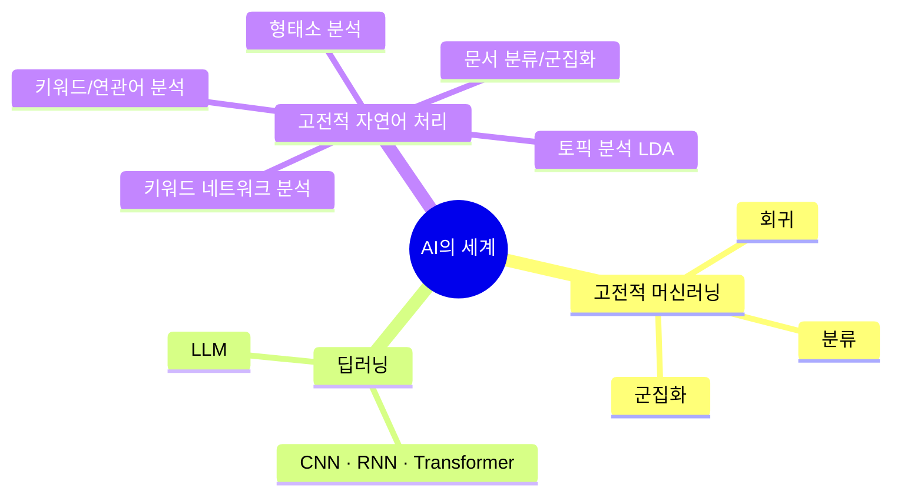
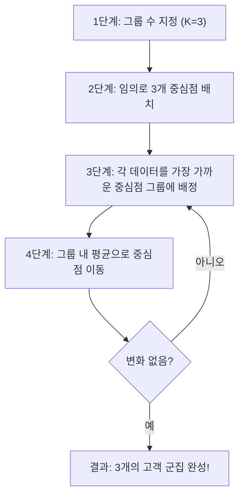
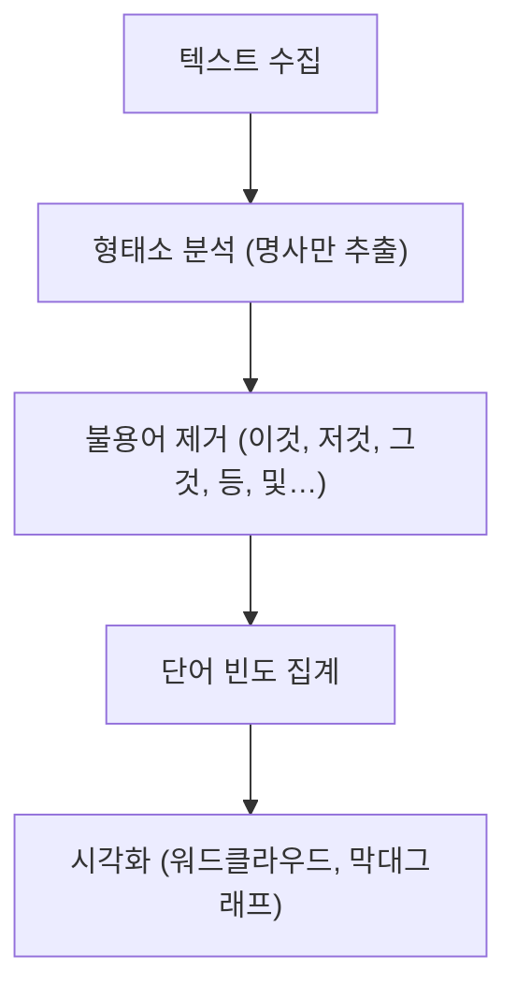
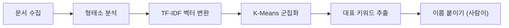
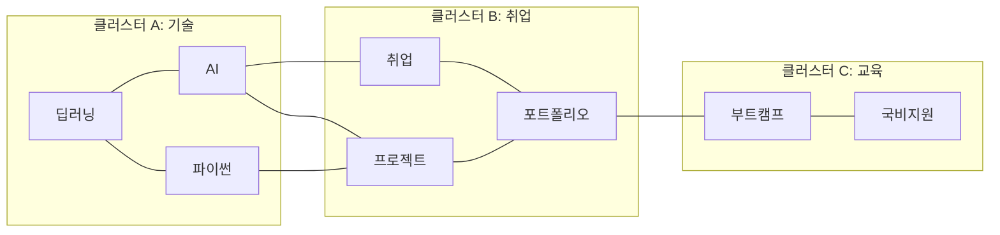
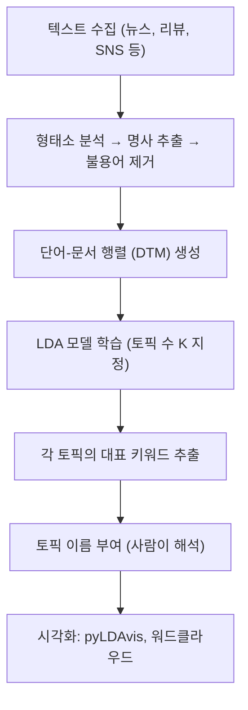
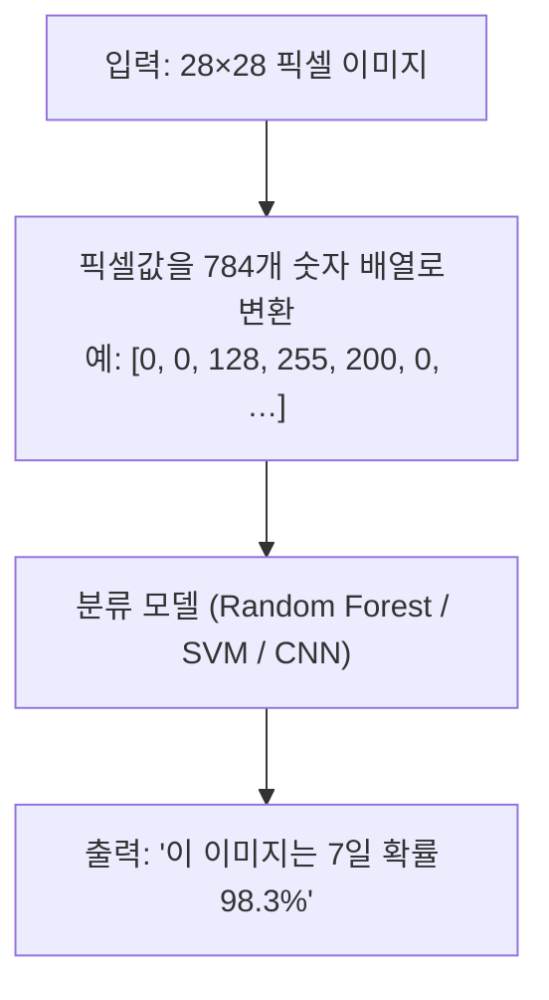
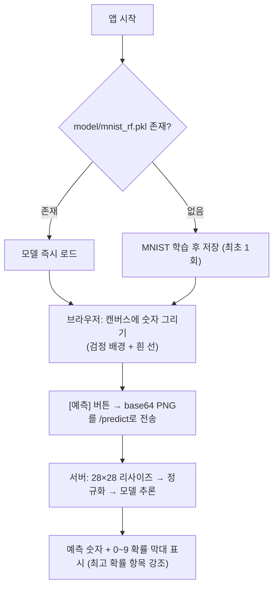

# LLM 이전의 AI를 만나다
### 고전적 머신러닝과 자연어 처리 기술의 이해

---

## 🚀 오프닝: "AI가 LLM만은 아니다"

여러분이 매일 사용하는 서비스를 생각해 보세요.

- 넷플릭스가 영화를 추천할 때
- 은행이 이상 거래를 탐지할 때
- 쇼핑몰이 "이 상품을 구매한 사람들이 함께 산 상품"을 보여줄 때
- 스팸 메일이 자동으로 걸러질 때

이 모든 기능의 밑바탕에는 ChatGPT가 없습니다.  
**수십 년 역사를 가진 고전적 머신러닝과 자연어 처리 기술**이 조용히 작동하고 있습니다.



> 💡 **핵심 메시지**: LLM은 강력하지만 비쌉니다. 고전적 AI 기술은 빠르고, 저렴하고, 설명 가능합니다. 좋은 AI 서비스 기획자는 둘을 구분하고 적재적소에 활용합니다.

---

## Part 1. 고전적 머신러닝 핵심 3가지

### 1-1. 회귀 (Regression) — "얼마일까요?"

**한 줄 정의**: 연속적인 숫자값을 예측하는 기술

**비유**: 부동산 중개인이 "이 아파트는 평수, 층수, 위치를 보면 대략 X억쯤 되겠군요" 하는 판단을 수학으로 만든 것

**실제 서비스 적용 사례**

- 중고차 플랫폼: 연식·주행거리·옵션 → 적정 시세 자동 산출
- 날씨 앱: 과거 기온 데이터 → 내일 기온 예측
- 광고 플랫폼: 캠페인 예산·기간·타겟팅 → 예상 클릭수 예측
- 전자상거래: 과거 매출 데이터 → 재고 수요 예측

**핵심 원리 (비개발자도 이해할 수 있는 수준)**

```
실제 데이터: 아파트 면적(㎡) vs 가격(만원)
  50㎡ → 30,000만원
  70㎡ → 42,000만원
  90㎡ → 54,000만원

모델이 찾은 규칙: 가격 ≈ 면적 × 600만원
→ 65㎡짜리? → 약 39,000만원 예측!
```

**기획자·디자이너가 알아야 할 포인트**

- 학습 데이터의 품질이 예측 정확도를 결정합니다
- 예측값에는 항상 오차 범위가 존재합니다 (± 표시 중요)
- 이상치(outlier) 데이터가 결과를 왜곡할 수 있습니다

---

### 1-2. 분류 (Classification) — "어느 쪽인가요?"

**한 줄 정의**: 데이터를 미리 정해진 카테고리 중 하나로 분류하는 기술

**비유**: 우체국 분류기가 우편번호를 보고 어느 지역 박스에 넣을지 결정하는 것

**실제 서비스 적용 사례**

- 이메일: 스팸(Spam) / 정상(Ham) 분류
- 금융: 대출 승인(Yes) / 거절(No) 판단
- 의료: X-ray 이미지 → 정상 / 이상 징후 감지
- CS 챗봇: 고객 문의 → 배송/환불/결제/기타 자동 분류
- SNS: 업로드 이미지 → 음란물 여부 자동 필터링

**핵심 원리**

```
학습 단계:
  "이 메일(광고 문구 포함, 모르는 발신인)은 스팸이야" × 10만 건
  "이 메일(동료 발신, 업무 내용)은 정상이야" × 10만 건
  → 모델이 스팸의 패턴을 학습

예측 단계:
  새로운 메일 → 모델 → "스팸일 확률 94%" → 스팸함으로!
```

**이진 분류 vs 다중 분류**

| 구분 | 예시 | 출력 |
|------|------|------|
| 이진 분류 | 스팸 여부 | Yes / No |
| 다중 분류 | 상품 카테고리 | 의류/식품/전자/가구/… |

**기획자·디자이너가 알아야 할 포인트**

- 분류 결과에는 확률값이 함께 나옵니다 (신뢰도 UI 설계에 중요)
- 오분류 비용을 고려해야 합니다: 스팸을 정상으로 분류 vs 정상을 스팸으로 분류, 어느 쪽이 더 나쁜가?
- 학습 데이터의 클래스 불균형 문제가 있습니다 (사기 거래는 전체의 0.1%뿐)

---

### 1-3. 군집화 (Clustering) — "비슷한 것끼리 묶어요"

**한 줄 정의**: 정답 없이 데이터를 스스로 비슷한 그룹으로 나누는 기술  
*(분류와의 결정적 차이: 군집화는 정답 레이블이 없는 비지도학습)*

**비유**: 새 학기 첫날 학생들을 아무런 기준 없이 섞어놓고, AI가 "취미, 성적, 거주지가 비슷한 학생들끼리 스스로 뭉쳐라"고 하는 것

**실제 서비스 적용 사례**

- 마케팅: 고객을 VIP/일반/이탈위험 등 세그먼트로 자동 분류
- 커머스: 구매 패턴이 유사한 고객 그룹 발견 → 개인화 추천
- 콘텐츠: 비슷한 기사들을 자동으로 토픽별로 묶기
- UX 리서치: 사용자 행동 로그를 분석해 사용자 유형 발견

**핵심 원리 (K-Means)**



**기획자·디자이너가 알아야 할 포인트**

- 그룹 수(K)는 사람이 결정해야 합니다 (비즈니스 맥락 필요)
- 군집의 이름/의미 해석은 도메인 전문가가 해야 합니다
- 결과는 확률이 아니라 그룹 번호로 나옵니다

---

## Part 2. 고전적 자연어 처리(NLP) 기술

> 이 영역은 **한국어 서비스**를 기획하는 여러분에게 특히 중요합니다.  
> 리뷰 분석, 검색 자동완성, 트렌드 파악 등 텍스트 기반 인사이트 서비스의 핵심입니다.

---

### 2-1. 형태소 분석 — 모든 텍스트 AI의 시작점

**한 줄 정의**: 문장을 의미 있는 최소 단위(형태소)로 쪼개는 기술

**왜 필요한가?** 컴퓨터는 "나는 학교에 갔다"를 그냥 문자열로 봅니다.  
형태소 분석을 하면 `나(대명사)`, `는(조사)`, `학교(명사)`, `에(조사)`, `가(동사)`, `았다(어미)`로 분리됩니다.

**한국어 형태소 분석기 종류**

| 도구 | 특징 | 주요 사용처 |
|------|------|------------|
| KoNLPy (Okt, Kkma 등) | Python, 오픈소스 | 스타트업, 분석 프로젝트 |
| 은전한닢 (mecab-ko) | 빠른 속도 | 대용량 처리 |
| Kiwi | 최신, 정확도 높음 | 현업 추천 |
| 네이버 clova | API 방식, 높은 정확도 | 상용 서비스 |

**형태소 분석 결과 예시**

```
입력: "오늘 배달음식이 너무 맛있었어요! 또 시킬게요"

출력:
  오늘    → 명사
  배달    → 명사
  음식    → 명사  ← 키워드 추출에 활용
  이      → 조사  ← 분석에서 제외(불용어)
  너무    → 부사
  맛있었어요 → 형용사
  또      → 부사
  시킬게요  → 동사
```

---

### 2-2. 키워드 분석 — "사람들이 뭘 말하고 있나?"

**한 줄 정의**: 텍스트에서 핵심 단어(명사 위주)를 추출하고 빈도를 분석하는 기술

**실제 서비스 적용 사례**

- 앱 리뷰 1만 건 → 자주 언급되는 불만 키워드 자동 파악
- SNS 모니터링 → 브랜드 관련 실시간 이슈 감지
- 검색 로그 분석 → 사용자가 실제로 찾는 것 파악
- 뉴스 트렌드 분석 → 요즘 화제의 주제 파악

**처리 흐름**



**워드클라우드 예시 — 카페 리뷰 분석**

```
자주 나온 단어: 커피(523), 분위기(412), 케이크(389), 
               친절(301), 웨이팅(287), 가격(245), 
               주차(198), 콘센트(187), 조용(156)...
```

→ "웨이팅"과 "주차"가 상위에 있다면? 운영팀에 즉시 액션 포인트!

---

### 2-3. 연관어 분석 — "함께 나오는 단어는?"

**한 줄 정의**: 특정 키워드와 함께 자주 등장하는 단어들의 관계를 분석하는 기술  
*(동시출현 분석, Co-occurrence Analysis)*

**실제 서비스 적용 사례**

- 검색 자동완성: "아이폰" 검색 시 → "케이스", "충전기", "할부" 연관 제시
- 상품 추천: "운동화" 구매자 → "양말", "깔창", "스포츠백" 함께 노출
- 리스크 모니터링: 브랜드명과 함께 "환불", "불량", "AS" 연관어 급증 감지
- 콘텐츠 기획: "건강식단"과 연관된 "간헐적단식", "저탄고지" 트렌드 파악

**원리**

```
문서들에서 같은 문장/문단 내 함께 나타나는 단어 쌍을 집계

"아이폰 케이스 추천해주세요" → (아이폰, 케이스) 공동 출현 +1
"아이폰 가격이 너무 비싸요" → (아이폰, 가격) 공동 출현 +1
...
→ 아이폰과 가장 많이 함께 나온 단어들: 케이스(1,203), 가격(987), 충전(876)...
```

---

### 2-4. 문서 분류 (Document Classification) — "이 글은 어떤 종류?"

**한 줄 정의**: 텍스트 문서를 미리 정해진 카테고리로 자동 분류하는 기술

**감성 분석(Sentiment Analysis)이 대표적 사례**

```
"배송이 빠르고 상품도 좋아요!" → 긍정 (Positive) 😊
"포장이 엉망이고 AS도 안 돼요" → 부정 (Negative) 😠
"평범한 제품이에요"             → 중립 (Neutral)  😐
```

**실제 서비스 적용 사례**

| 서비스 | 분류 기준 | 활용 |
|--------|-----------|------|
| 고객센터 | 문의 유형 (배송/결제/교환/기타) | 담당자 자동 배정 |
| 뉴스 플랫폼 | 섹션 (정치/경제/스포츠/연예) | 자동 카테고리 게시 |
| 쇼핑몰 | 리뷰 감성 (긍/부정) | 별점 보완 지표 |
| HR 시스템 | 이력서 직무 적합도 | 1차 필터링 |

**고전적 방법 (TF-IDF + 머신러닝 분류기)**

```
1. 텍스트 → 형태소 분석 → 명사/형용사 추출
2. TF-IDF로 단어 중요도 수치화 (벡터 변환)
3. 나이브 베이즈, SVM, 랜덤포레스트 등으로 분류 학습
4. 새 텍스트 → 동일 변환 → 분류 결과 출력
```

> 💡 **LLM과의 비교**: GPT에게 "이 리뷰 긍정/부정 분류해줘"도 가능합니다.  
> 하지만 리뷰 100만 건 처리 비용과 속도를 생각하면? → 고전적 분류 모델이 압도적으로 유리합니다.

---

### 2-5. 문서 군집화 (Document Clustering) — "비슷한 글끼리 묶어요"

**한 줄 정의**: 정답 없이 내용이 유사한 문서들을 자동으로 그룹으로 묶는 기술

**실제 서비스 적용 사례**

- 뉴스 자동 토픽 그룹화: 같은 사건의 기사들을 하나의 클러스터로
- VOC(고객 목소리) 분석: 수천 건의 불만 글을 자동으로 이슈별 그룹화
- 특허 분석: 유사 기술 특허 문서 자동 군집화
- 커뮤니티 분석: 게시글을 주제별로 자동 분류

**처리 흐름**



---

### 2-6. 키워드 네트워크 분석 (Keyword Network Analysis)

**한 줄 정의**: 단어들의 동시출현 관계를 네트워크 그래프로 시각화해 개념 구조와 영향력을 분석하는 기술

**연관어 분석의 진화된 형태** — 단순한 "함께 나온 단어 목록"을 넘어, 어떤 단어가 허브(중심)인지, 어떤 단어 그룹이 클러스터를 이루는지까지 파악합니다.

**핵심 개념**

- **노드(Node)**: 단어 (크기 = 중요도/빈도)
- **엣지(Edge)**: 두 단어의 동시출현 (굵기 = 연관 강도)
- **허브(Hub)**: 많은 단어와 연결된 핵심 개념
- **클러스터**: 서로 밀접하게 연결된 단어 그룹

"AI 취업" 관련 커뮤니티 분석 결과:



**네트워크 지표 해석**

| 지표 | 의미 | 활용 |
|------|------|------|
| 연결 중심성 (Degree) | 몇 개 단어와 연결되었나 | 핵심 키워드 파악 |
| 매개 중심성 (Betweenness) | 다른 단어들을 잇는 다리 역할 | 이슈 연결고리 파악 |
| 클러스터 계수 | 주변 단어들끼리 얼마나 연결되나 | 토픽 그룹 경계 파악 |

**실제 서비스 적용 사례**

- 브랜드 인식 지도: 내 브랜드 주변에 형성된 개념 군집 구조 파악
- 트렌드 확산 분석: 이슈가 어떤 개념들을 거쳐 확산되는지 경로 추적
- 학술/특허 분석: 연구 키워드 네트워크로 기술 흐름과 공백 영역 시각화
- 소비자 인식 조사: 설문·인터뷰 텍스트에서 인식 구조 발견
- 경쟁사 모니터링: 경쟁 브랜드와 자사 브랜드의 연관어 네트워크 비교

**도구**

```
Python: networkx + matplotlib / pyvis (인터랙티브)
온라인: 텍스톰(Textom), NodeXL
시각화: Gephi (전문 네트워크 분석 도구)
```

**기획자·디자이너가 알아야 할 포인트**

- 네트워크 시각화는 그 자체로 강력한 스토리텔링 도구입니다 (보고서, 발표자료에 활용)
- 중심성이 높은 단어 = 해당 담론의 핵심 의제 → 전략 수립의 시작점
- 분리된 클러스터가 있다면 서로 다른 사용자 집단이나 문화권을 의미할 수 있습니다

---

### 2-7. 토픽 분석 (Topic Modeling / LDA)

**한 줄 정의**: 대량의 문서 집합에서 숨겨진 주제(토픽)를 자동으로 발견하는 기술  
*(가장 대표적 알고리즘: LDA – Latent Dirichlet Allocation)*

**군집화와의 차이점**

```
문서 군집화: 하나의 문서 = 하나의 클러스터 (딱 하나의 그룹에 소속)
토픽 분석:  하나의 문서 = 여러 토픽의 혼합 (확률 분포로 표현)

예시: "AI 스타트업 투자 현황"이라는 기사
  → 토픽 A(AI 기술): 40%  
  → 토픽 B(스타트업 생태계): 35%  
  → 토픽 C(투자/금융): 25%
```

**핵심 원리 (LDA)**

```
가정: 각 문서는 여러 토픽이 섞여 있고,
      각 토픽은 특정 단어들이 자주 등장하는 분포다.

입력: 뉴스 기사 10,000건, 토픽 수 K=5 지정
출력:
  토픽 1: 경제(0.18), 금리(0.15), 부동산(0.12), 물가(0.10)...
  토픽 2: AI(0.20), 반도체(0.17), 스타트업(0.13), 투자(0.11)...
  토픽 3: 선거(0.22), 정당(0.16), 후보(0.14), 공약(0.09)...
  토픽 4: 야구(0.24), 우승(0.18), 선수(0.15), 경기(0.12)...
  토픽 5: 기후(0.19), 탄소(0.16), 재생에너지(0.13), 환경(0.11)...
```

**실제 서비스 적용 사례**

| 서비스 | 활용 방법 | 효과 |
|--------|-----------|------|
| 뉴스 플랫폼 | 기사 토픽 자동 분류 및 트렌드 추적 | 에디터 작업 시간 단축 |
| 고객센터 | VOC 토픽 변화 모니터링 | 이슈 조기 감지 |
| 리서치 기관 | 소셜 데이터의 여론 토픽 분석 | 정책/전략 수립 근거 |
| 커머스 | 상품 리뷰 토픽 분석 → 개선점 도출 | 제품 개발 방향 설정 |
| 학술 | 논문 토픽 트렌드 분석 | 연구 공백 영역 발견 |

**처리 흐름**



**Python 코드 예시**

```python
# pip install gensim pyLDAvis kiwipiepy matplotlib

import platform
from kiwipiepy import Kiwi
from gensim import corpora, models
import pyLDAvis.gensim_models
import matplotlib.pyplot as plt
import matplotlib.font_manager as fm

# 플랫폼별 한글 폰트 설정
_system = platform.system()
if _system == 'Darwin':
    plt.rcParams['font.family'] = 'AppleGothic'
elif _system == 'Windows':
    plt.rcParams['font.family'] = 'Malgun Gothic'
else:  # Linux 등
    _nanum = [f.name for f in fm.fontManager.ttflist if 'Nanum' in f.name]
    if _nanum:
        plt.rcParams['font.family'] = _nanum[0]
plt.rcParams['axes.unicode_minus'] = False

# 1. 형태소 분석 (명사 추출)
print("[1/5] 형태소 분석기 초기화 중...")
kiwi = Kiwi()

def extract_nouns(text):
    result = kiwi.analyze(text)
    nouns = [token.form for token in result[0][0]
             if token.tag.startswith('NN') and len(token.form) > 1]
    return nouns

# 2. 샘플 문서 (2025년 국내 주요 뉴스 헤드라인 50건)
docs = [
    # AI · 기술
    "챗GPT 구독 결제 급증, 국내 생성형 AI 시장 폭발적 성장",
    "삼성전자 HBM 반도체 엔비디아 납품 승인, 주가 급등",
    # 경제 · 금융
    "코스피 4000선 돌파, 사상 첫 '사천피' 시대 개막",
    "장바구니 물가 5년 새 23% 급등, 서민 가계 부담 가중",
    # 환경 · 에너지
    "지구 평균 기온 파리협약 목표 1.5도 초과, 기후 위기 경보",
    "정부 재생에너지 확대 로드맵 발표, 2030년 태양광·풍력 40% 목표",
    # 스포츠
    "하얼빈 동계 아시안게임 금메달 16개, 한국 종합 2위 쾌거",
    # ... (총 50건 — script/topic_model.py 참조)
]

# 3. 전처리
print(f"\n[2/5] 형태소 분석 중... (문서 {len(docs)}건)")
tokenized = [extract_nouns(doc) for doc in docs]

# 4. 사전 및 행렬 생성
print(f"\n[3/5] 단어 사전 및 문서-단어 행렬 생성 중...")
dictionary = corpora.Dictionary(tokenized)
corpus = [dictionary.doc2bow(doc) for doc in tokenized]
print(f"      완료 — 고유 단어 {len(dictionary)}개, 문서 {len(corpus)}건")

# 5. LDA 모델 학습
print(f"\n[4/5] LDA 모델 학습 중... (토픽 6개, passes=50)")
lda_model = models.LdaModel(
    corpus=corpus,
    id2word=dictionary,
    num_topics=6,   # 토픽 수: AI/기술, 경제, 부동산, 환경, 사회, 스포츠/정치
    passes=50,
    random_state=42
)

# 6. 토픽 출력
print(f"\n[5/5] 결과 출력 및 시각화\n")
for i, topic in lda_model.print_topics(num_words=7):
    print(f"토픽 {i+1}: {topic}")

# 7. 인터랙티브 시각화
vis = pyLDAvis.gensim_models.prepare(lda_model, corpus, dictionary)
pyLDAvis.save_html(vis, 'lda_result.html')

# 8. 분석 리포트 저장 (lda_analysis.md)
with open('lda_analysis.md', 'w', encoding='utf-8') as f:
    f.write(f"# LDA 토픽 모델링 분석 리포트\n\n")
    f.write(f"- 분석 문서 수: **{len(docs)}건**\n")
    f.write(f"- 토픽 수: **{lda_model.num_topics}개**\n\n")
    for i in range(lda_model.num_topics):
        f.write(f"## 토픽 {i+1}\n")
        for word, prob in lda_model.show_topic(i, topn=10):
            f.write(f"- {word}: {prob:.4f}\n")
        f.write("\n")
```

**토픽 분석 결과 해석 방법**

```
좋은 토픽 모델의 특징:
  ✅ 각 토픽의 키워드들이 의미적으로 일관됨
  ✅ 토픽 간 중복 키워드가 적음
  ✅ 비즈니스 팀이 토픽에 이름 붙이기 쉬움

나쁜 토픽 모델의 특징:
  ❌ 토픽 키워드가 잡다하고 연관성 없음
  ❌ 여러 토픽이 거의 같은 키워드를 가짐
  → 해결: K 값 조정, 불용어 보완, 데이터 추가
```

**기획자·디자이너가 알아야 할 포인트**

- 토픽 수(K)는 알고리즘이 정하지 않습니다 — 여러 K를 시도해보고 사람이 판단해야 합니다
- 토픽에 이름을 붙이는 것은 반드시 도메인 전문가가 해야 합니다
- 시간축을 추가하면 **토픽 트렌드 분석** 가능 → "3개월 전 vs 지금 주요 이슈 변화"
- LLM과의 조합: LDA로 토픽 추출 → GPT로 토픽 설명문 자동 생성하면 강력한 자동화 가능

---

## Part 3. 실습 데모 — MNIST 필기 숫자 인식

> 이 데모는 고전적 머신러닝의 **분류(Classification)** 를 가장 직관적으로 체험하는 예제입니다.

### MNIST 데이터셋이란?

```
- 0~9 필기 숫자 이미지 70,000장 (28×28 픽셀)
- 훈련용 60,000장 + 테스트용 10,000장
- 1998년 공개, 머신러닝의 "Hello World"
- 각 이미지에 정답 레이블(0~9)이 있음 → 지도학습(분류)
```

### 어떻게 동작하는가?



### 실제 구현 코드 스니펫 (Python)

```python
# 필요 라이브러리 설치
# pip install scikit-learn matplotlib

import platform
from sklearn.datasets import fetch_openml
from sklearn.ensemble import RandomForestClassifier
from sklearn.metrics import accuracy_score
import matplotlib.pyplot as plt
import matplotlib.font_manager as fm

# 플랫폼별 한글 폰트 설정 (그래프 제목 한글 깨짐 방지)
_system = platform.system()
if _system == 'Darwin':
    plt.rcParams['font.family'] = 'AppleGothic'
elif _system == 'Windows':
    plt.rcParams['font.family'] = 'Malgun Gothic'
else:  # Linux 등
    _nanum = [f.name for f in fm.fontManager.ttflist if 'Nanum' in f.name]
    if _nanum:
        plt.rcParams['font.family'] = _nanum[0]
plt.rcParams['axes.unicode_minus'] = False

# 1. 데이터 로드
print("데이터 로딩 중...")
mnist = fetch_openml('mnist_784', version=1, as_frame=False)
X, y = mnist.data, mnist.target

# 2. 학습/테스트 분리 (60,000 학습 / 10,000 테스트)
X_train, X_test = X[:60000], X[60000:]
y_train, y_test = y[:60000], y[60000:]

# 3. 픽셀값 정규화 (0~255 → 0~1)
X_train = X_train / 255.0
X_test = X_test / 255.0

# 4. 모델 학습
print("모델 학습 중...")
model = RandomForestClassifier(n_estimators=100, random_state=42)
model.fit(X_train, y_train)

# 5. 예측 및 정확도 측정
y_pred = model.predict(X_test)
accuracy = accuracy_score(y_test, y_pred)
print(f"정확도: {accuracy:.4f}")  # 약 97% 달성!

# 6. 시각화: 예측 결과 확인
fig, axes = plt.subplots(2, 5, figsize=(12, 5))
for i, ax in enumerate(axes.flat):
    ax.imshow(X_test[i].reshape(28, 28), cmap='gray')
    ax.set_title(f"예측: {y_pred[i]}\n실제: {y_test[i]}")
    ax.axis('off')
plt.tight_layout()
plt.show()
```

### 결과 해석

```
✅ 정확도 약 97% — 사람 100장 중 97장은 맞힘
❌ 틀리는 경우 예시:
   - 손글씨가 너무 독특한 경우
   - 4와 9, 1과 7 혼동
   - 기울어지거나 크기가 매우 다른 경우
```

### 기획자·디자이너를 위한 인사이트

이 데모를 통해 알 수 있는 것:

1. **데이터가 모델이다**: 70,000장의 레이블된 데이터 없이는 불가능
2. **정확도 97%의 의미**: 100번 중 3번 틀림 → 의료/금융 서비스에선 치명적일 수 있음
3. **실서비스 적용 시**: 오분류 케이스를 사람이 검수하는 Human-in-the-Loop 설계 필요
4. **확장 가능성**: 같은 원리로 손글씨 영수증 인식, 서명 인증, 문서 스캔 분류 가능

---

## 마무리: 언제 무엇을 써야 하는가?

### 기술 선택 가이드

```
┌─────────────────────────────────────────────────────────┐
│                  AI 기술 선택 의사결정                    │
├─────────────────┬───────────────────────────────────────┤
│ 상황            │ 적합한 기술                            │
├─────────────────┼───────────────────────────────────────┤
│ 수치를 예측     │ 회귀 (가격, 수요, 기온)                │
│ 카테고리 분류   │ 분류 (스팸, 감성, 유형)                │
│ 그룹 자동 발견  │ 군집화 (고객 세그먼트)                 │
│ 텍스트 핵심 파악│ 키워드 분석 (리뷰, VOC)               │
│ 개념 관계 구조  │ 키워드 네트워크 (브랜드, 트렌드 허브)  │
│ 숨은 주제 발견  │ 토픽 분석/LDA (뉴스, 리뷰 토픽 추출)  │
│ 대화/질의응답   │ LLM (ChatGPT, Claude)                 │
│ 이미지 생성     │ 이미지 생성 AI (Midjourney, DALL-E)   │
└─────────────────┴───────────────────────────────────────┘
```

### 고전적 AI vs LLM 비교

| 항목 | 고전적 ML/NLP | LLM (GPT, Claude 등) |
|------|---------------|----------------------|
| 처리 속도 | 매우 빠름 | 상대적으로 느림 |
| 비용 | 저렴 | 토큰당 비용 발생 |
| 정확도 | 특정 태스크 특화 시 높음 | 범용, 유연 |
| 설명 가능성 | 높음 | 낮음 (블랙박스) |
| 데이터 필요량 | 수천~수만 건 | 거의 불필요 (Few-shot) |
| 유지보수 | 재학습 필요 | 프롬프트 수정으로 대응 |
| 적합한 태스크 | 반복적, 대용량, 예측 | 창의적, 복잡한 이해 |

### 오늘의 핵심 메시지 3가지

> **1️⃣ AI 서비스 = LLM이 아닙니다**  
> 여러분 주변 대부분의 AI 서비스는 고전적 ML과 NLP로 운영 중입니다.

> **2️⃣ 기획자·디자이너도 기술을 이해해야 합니다**  
> 구현 방법은 몰라도, "이 기능엔 분류 모델이 필요하고, 학습 데이터가 필요하다"는 판단은 할 수 있어야 합니다.

> **3️⃣ 데이터가 AI 서비스의 핵심 자산입니다**  
> 어떤 데이터를 어떻게 모을지가 기획 단계부터 설계되어야 합니다.

---

## Part 4. 실습 데모 — MNIST 웹 앱 (app.py)

> MNIST 분류 모델을 Flask 웹 서버로 감싸, 브라우저에서 직접 숫자를 그리고 예측 결과를 확인하는 인터랙티브 데모입니다.

### 실행 방법

```bash
uv run python script/app.py
# 브라우저에서 http://127.0.0.1:8080 접속
```

최초 실행 시 MNIST 학습 후 `model/mnist_rf.pkl`로 저장하고, 이후 실행부터는 저장된 모델을 즉시 로드합니다.

### 동작 구조



### 핵심 코드

```python
# pip install flask pillow scikit-learn

import base64, io, joblib, numpy as np
from PIL import Image
from flask import Flask, request, jsonify, render_template_string
from sklearn.datasets import fetch_openml
from sklearn.ensemble import RandomForestClassifier

MODEL_PATH = 'model/mnist_rf.pkl'
app = Flask(__name__)
model = None

def load_or_train():
    global model
    if os.path.exists(MODEL_PATH):
        model = joblib.load(MODEL_PATH)          # 저장된 모델 로드
    else:
        mnist = fetch_openml('mnist_784', version=1, as_frame=False)
        X, y = mnist.data / 255.0, mnist.target
        model = RandomForestClassifier(n_estimators=100, random_state=42, n_jobs=-1)
        model.fit(X[:60000], y[:60000])
        joblib.dump(model, MODEL_PATH)           # 모델 저장

@app.route('/predict', methods=['POST'])
def predict():
    # 캔버스 이미지(base64 PNG) → 28×28 배열 → 모델 추론
    img_bytes = base64.b64decode(request.json['image'].split(',')[1])
    img = Image.open(io.BytesIO(img_bytes)).convert('L').resize((28, 28))
    arr = np.array(img, dtype=np.float32).reshape(1, -1) / 255.0

    pred  = model.predict(arr)[0]
    proba = model.predict_proba(arr)[0]
    return jsonify({
        'prediction': pred,
        'probabilities': [{'digit': c, 'prob': float(p)}
                          for c, p in zip(model.classes_, proba)]
    })

if __name__ == '__main__':
    load_or_train()
    app.run(host='0.0.0.0', port=8080)
```

### 기획자·디자이너가 알아야 할 포인트

- **모델 저장(Persistence)**: 학습된 모델을 파일로 저장해 두면 서비스 재시작 시에도 재학습 없이 즉시 사용 가능 — 실제 서비스에서 필수 패턴
- **입력 전처리의 중요성**: 캔버스는 280×280이지만 MNIST는 28×28 — 리사이즈·정규화 없이는 정확도가 크게 떨어짐
- **확률 제공**: 단순 "예측값" 대신 0~9 각각의 확률을 제공하면 UX에서 신뢰도 표시에 활용 가능

---

## 📚 더 알아보기

**무료 실습 환경**

- [Google Colab](https://colab.research.google.com) — 브라우저에서 바로 Python 실행
- [Kaggle](https://www.kaggle.com) — 다양한 데이터셋과 튜토리얼

**추천 학습 자료**

- scikit-learn 공식 문서: <https://scikit-learn.org>
- KoNLPy 한국어 NLP: <https://konlpy.org>
- 구글 머신러닝 입문 강좌: <https://developers.google.com/machine-learning/crash-course>
